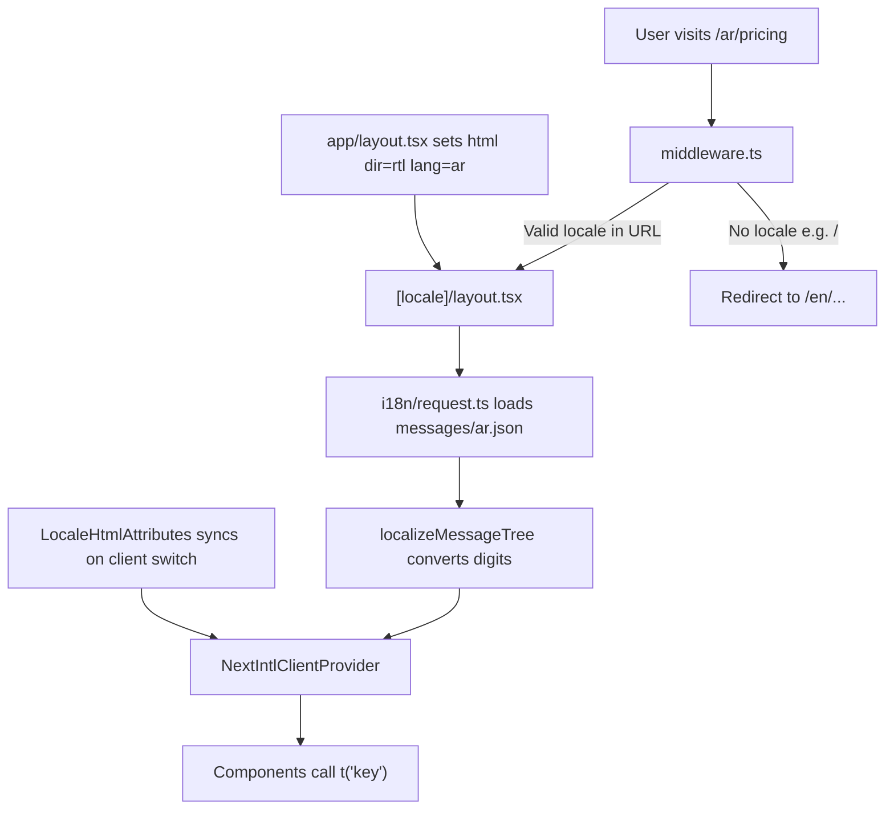

# Complete Guide: Arabic & English Translation in Aventra

This project uses **[next-intl v4](https://next-intl.dev/)** (not Next.js built-in i18n). Every user-facing page lives under `/en/...` or `/ar/...`. Text comes from JSON message files; layout, fonts, and direction switch automatically based on locale.

---

## Big Picture: What Happens When a User Visits the Site



**In plain terms:**
1. Middleware ensures every URL has a locale prefix (`/en` or `/ar`).
2. Server loads the correct JSON file (`messages/en.json` or `messages/ar.json`).
3. Messages are passed to React via `NextIntlClientProvider`.
4. Components read text with `t("someKey")` instead of hardcoded strings.
5. HTML gets `dir="rtl"` and Cairo font for Arabic; `dir="ltr"` and Geist/Inter for English.

---

## Layer 1: Configuration Files

### 1. [`src/i18n/routing.ts`](src/i18n/routing.ts) — Which languages exist and how URLs work

```typescript
export const routing = defineRouting({
  locales: ['en', 'ar'],
  defaultLocale: 'en',
  localePrefix: 'always',
});
export const { Link, redirect, usePathname, useRouter } = createNavigation(routing);
```

| Setting | Purpose |
|---------|---------|
| `locales: ['en', 'ar']` | Only English and Arabic are supported |
| `defaultLocale: 'en'` | Fallback when locale is missing or invalid |
| `localePrefix: 'always'` | Every URL must include locale: `/en/pricing`, not `/pricing` |
| `createNavigation(...)` | Exports special `Link`, `useRouter`, etc. that automatically prepend the current locale to paths |

**Why it matters:** Without this file, Next.js would not know which locales exist. The exported `Link` lets you write `href="/pricing"` and it renders as `/en/pricing` or `/ar/pricing` depending on current language.

---

### 2. [`src/i18n/request.ts`](src/i18n/request.ts) — Loads translations on each server request

```typescript
export default getRequestConfig(async ({ requestLocale }) => {
  let locale = await requestLocale;
  if (!locale || !routing.locales.includes(locale as any)) {
    locale = routing.defaultLocale;
  }
  const messages = (await import(`../../messages/${locale}.json`)).default;
  return {
    locale,
    messages: localizeMessageTree(messages, locale),
  };
});
```

**What each part does:**
- `getRequestConfig` — next-intl hook that runs on every server request
- `requestLocale` — reads locale from URL segment `[locale]`
- Dynamic import — loads `messages/en.json` or `messages/ar.json` at runtime
- `localizeMessageTree` — for Arabic, converts Western digits `123` to Arabic-Indic `١٢٣` in all message strings

**Why it matters:** This is the bridge between JSON files and React. Without it, `useTranslations()` would have nothing to read.

---

### 3. [`middleware.ts`](middleware.ts) — First gate for every HTTP request

```typescript
export default createMiddleware(routing);
export const config = {
  matcher: ['/((?!_next/static|_next/image|favicon.ico|sitemap.xml|robots.txt).*)'],
};
```

**What it does:**
- Intercepts requests before they reach pages
- Redirects `/` → `/en/` (or detected locale from cookie/browser)
- Sets `NEXT_LOCALE` cookie so root layout knows the language on first paint
- Skips static files (`_next/static`, images, favicon)

**Why it matters:** Ensures users always land on a valid locale-prefixed URL. Without middleware, `/pricing` would 404 because pages only exist under `[locale]`.

---

### 4. [`next.config.ts`](next.config.ts) — Connects next-intl to Next.js

```typescript
const withNextIntl = createNextIntlPlugin('./src/i18n/request.ts');
export default withNextIntl(nextConfig);
```

**Purpose:** Wraps the Next.js config with the next-intl plugin, pointing it to `request.ts`. This wires server-side message loading into the build.

---

## Layer 2: App Router Structure

### All pages moved under [`src/app/[locale]/`](src/app/[locale]/)

Before i18n, pages were likely at `src/app/page.tsx`. Now:

```
src/app/
├── layout.tsx              ← Root HTML shell (fonts, dir, lang)
├── globals.css             ← RTL CSS overrides
└── [locale]/               ← Dynamic segment: "en" or "ar"
    ├── layout.tsx          ← Loads messages, wraps with provider
    ├── page.tsx            ← Home page
    ├── pricing/page.tsx
    ├── login/page.tsx
    ├── company/...
    └── user/...
```

**Example URLs:**
- `/en/` → English home
- `/ar/pricing` → Arabic pricing
- `/en/company/search` → English company search

The `[locale]` folder name becomes the URL segment. Next.js passes it as `params.locale`.

---

### [`src/app/[locale]/layout.tsx`](src/app/[locale]/layout.tsx) — Locale-specific wrapper

Key responsibilities:

| Code | Purpose |
|------|---------|
| `generateStaticParams()` | Pre-builds both `/en/...` and `/ar/...` at build time |
| `if (!routing.locales.includes(locale)) notFound()` | Returns 404 for invalid locales like `/fr/` |
| `setRequestLocale(locale)` | Enables static rendering optimization in next-intl |
| `getMessages({ locale })` | Fetches loaded JSON messages for this locale |
| `<NextIntlClientProvider>` | Makes messages available to all child components via hooks |
| `<LocaleHtmlAttributes>` | Updates `html` attributes when user switches language client-side |
| `<Navbar />` + `<Footer />` | Shared chrome on every page |

---

### [`src/app/layout.tsx`](src/app/layout.tsx) — Root HTML element

```typescript
const locale = resolveLocale(cookieStore.get("NEXT_LOCALE")?.value);
const isRTL = locale === "ar";

return (
  <html lang={locale} dir={isRTL ? "rtl" : "ltr"} className={isRTL ? "font-arabic" : "font-sans"}>
```

**What it does:**
- Reads `NEXT_LOCALE` cookie (set by middleware) for SSR first paint
- Sets `lang="ar"` or `lang="en"` for accessibility and SEO
- Sets `dir="rtl"` for Arabic (right-to-left layout) or `dir="ltr"` for English
- Loads fonts: **Geist + Inter** for English, **Cairo** for Arabic
- Applies font class on `<html>` so entire page uses correct typography

**Why two layouts?** Root layout handles `<html>`/`<body>` (runs once). Locale layout handles messages and page chrome (runs per locale).

---

## Layer 3: Translation Files

### [`messages/en.json`](messages/en.json) and [`messages/ar.json`](messages/ar.json)

Both files have **identical key structure** (~283 lines). Arabic file has translated values.

**Organization by namespace (top-level keys):**

| Namespace | Used in | Content |
|-----------|---------|---------|
| `navbar` | Navbar | Home, Pricing, Sign in, etc. |
| `footer` | Footer | Description, links, trust badges, copyright |
| `landing` | Landing hero | Titles, subtitles, CTAs, mock UI labels |
| `marquee` | SliderAnimation | Scrolling badge items array |
| `grid` | GridDescription | Bento grid dashboard copy |
| `whatServe` | WhatServe | B2C/B2B sections, feature cards |
| `siteStats` | SiteStats (server) | Screenshot section text |
| `language` | LanguageSwitcher | "English" / "العربية" button labels |

**Example structure:**

```json
{
  "navbar": { "home": "Home", "pricing": "Pricing" },
  "landing": {
    "titleLine1": "Beat the ATS",
    "trust": { "noCard": "No credit card required" }
  },
  "marquee": {
    "items": [{ "label": "AI-Powered Hiring", "variant": "default" }]
  }
}
```

**Rules when adding translations:**
- Keys must match exactly in both files
- Use nested objects for grouped UI sections
- Use arrays for lists (marquee items, feature bullets)
- Numbers in Arabic JSON can stay Western (`123`) — `localizeMessageTree` converts them automatically

---

## Layer 4: Arabic-Specific Formatting

### [`src/lib/locale-format.ts`](src/lib/locale-format.ts)

Three functions:

| Function | Purpose |
|----------|---------|
| `toArabicNumerals(text)` | Converts `0-9` → `٠-٩` in any string |
| `formatLocalizedNumber(value, locale)` | Uses `Intl.NumberFormat` with `ar-EG` for Arabic |
| `localizeMessageTree(messages, locale)` | Recursively walks entire JSON tree and converts all digits in Arabic mode |

**Why:** Arabic users expect Eastern Arabic-Indic numerals (٠١٢٣), not Western (0123). This runs once at message load time so every `t("key")` already has correct digits.

---

### [`src/hooks/useLocaleFormat.ts`](src/hooks/useLocaleFormat.ts)

Client-side hook for dynamic numbers not in JSON:

```typescript
const { n, digits } = useLocaleFormat();
n(47300)        // → "47,300" or "٤٧٬٣٠٠"
digits("4.9")   // → "4.9" or "٤.٩"
```

Used in Footer (copyright year), Landing (stats), GridDescription, WhatServe for inline numbers.

---

## Layer 5: RTL / LTR Support

### [`src/components/shared/LocaleHtmlAttributes.tsx`](src/components/shared/LocaleHtmlAttributes.tsx)

Client component that runs `useLayoutEffect` when locale changes:

```typescript
html.lang = locale;
html.dir = isRTL ? "rtl" : "ltr";
html.classList.add(isRTL ? "font-arabic" : "font-sans");
```

**Why needed:** Root layout reads cookie on first SSR. When user clicks LanguageSwitcher without full reload, this syncs `<html>` attributes immediately.

---

### [`src/app/globals.css`](src/app/globals.css) (lines 166–186)

```css
html[dir="ltr"] { font-family: var(--font-sans), sans-serif; }
html[dir="rtl"] { font-family: var(--font-cairo), sans-serif; }

/* Flip Tailwind spacing for RTL */
html[dir="rtl"] .ml-4  { margin-left: 0; margin-right: 1rem; }
html[dir="rtl"] .text-left { text-align: right; }
```

**Purpose:** CSS automatically mirrors margins, padding, and text alignment when `dir="rtl"`. Some components also use `dir="ltr"` locally (marquees, numeric chips) where RTL would break animations.

---

## Layer 6: Language Switching

### [`src/components/feature/LanguageSwitcher.tsx`](src/components/feature/LanguageSwitcher.tsx)

```typescript
const switchLocale = (newLocale) => {
  router.replace(pathname, { locale: newLocale, scroll: false });
};
```

**Flow when user clicks "العربية":**
1. Gets current path without locale (e.g. `/pricing`)
2. `router.replace` navigates to `/ar/pricing` (same page, new locale)
3. New messages load from `ar.json`
4. `LocaleHtmlAttributes` sets `dir="rtl"`
5. Page re-renders in Arabic without scrolling to top

**Prefetch:** On mount, prefetches alternate locale routes for faster switching.

Mounted in Navbar (desktop + mobile menu).

---

## Layer 7: How Components Use Translations

### Pattern A: Client components — `useTranslations`

Used in: Navbar, Footer, Landing, GridDescription, WhatServe, LanguageSwitcher, SliderAnimation

```typescript
"use client";
import { useTranslations } from "next-intl";

export default function Navbar() {
  const t = useTranslations("navbar");
  return <Link href="/">{t("home")}</Link>;  // "Home" or "الرئيسية"
}
```

**Variations:**
- `t("home")` — simple string
- `t("trust.secureTitle")` — nested key (or use namespace `"footer"` + shorter key)
- `t.raw("items")` — returns array/object from JSON (not a string)
- `t(\`stages.${key}\`)` — dynamic key lookup

---

### Pattern B: Server components — `getTranslations`

Used in: [`siteStats.tsx`](src/components/feature/siteStats.tsx) only

```typescript
const t = await getTranslations("siteStats");
return <h2>{t("title")}</h2>;
```

**Why async:** Server components cannot use React hooks. `getTranslations` is the server equivalent of `useTranslations`.

---

### Pattern C: Locale-aware links — `Link` from `@/i18n/routing`

```typescript
import { Link } from "@/i18n/routing";
<Link href="/pricing">{t("pricing")}</Link>
// Renders: /en/pricing or /ar/pricing automatically
```

**Do NOT use** `next/link` with hardcoded `/en/...` paths — use this `Link` instead.

---

### Pattern D: Pages call `setRequestLocale`

```typescript
// src/app/[locale]/page.tsx
export default async function HomePage({ params }) {
  const { locale } = await params;
  setRequestLocale(locale);  // Required for static generation
  return <Landing />;
}
```

Pages don't translate directly — they compose already-translated components.

---

## What Is Translated vs Not Yet Translated

| Area | Status |
|------|--------|
| Navbar, Footer | Fully translated |
| Landing page (hero, grid, whatServe, stats) | Fully translated |
| Marquee / slider badges | Fully translated |
| Auth pages (`login`, `register`) | Hardcoded English |
| Dashboard pages (`user/*`, `company/*`) | Hardcoded English |
| `not-found.tsx` | Hardcoded English, uses plain `next/link` |
| Pricing page | Likely hardcoded English |

---

## File Checklist: Every i18n-Related File and Its Job

| File | Job |
|------|-----|
| [`src/i18n/routing.ts`](src/i18n/routing.ts) | Define locales, export locale-aware navigation |
| [`src/i18n/request.ts`](src/i18n/request.ts) | Load JSON messages per request |
| [`middleware.ts`](middleware.ts) | Redirect and detect locale on every request |
| [`next.config.ts`](next.config.ts) | Register next-intl plugin |
| [`messages/en.json`](messages/en.json) | English strings |
| [`messages/ar.json`](messages/ar.json) | Arabic strings (same keys) |
| [`src/app/[locale]/layout.tsx`](src/app/[locale]/layout.tsx) | Provider + validate locale |
| [`src/app/layout.tsx`](src/app/layout.tsx) | HTML dir/lang/fonts from cookie |
| [`src/lib/locale-format.ts`](src/lib/locale-format.ts) | Arabic numeral conversion |
| [`src/hooks/useLocaleFormat.ts`](src/hooks/useLocaleFormat.ts) | Client number formatting hook |
| [`src/components/shared/LocaleHtmlAttributes.tsx`](src/components/shared/LocaleHtmlAttributes.tsx) | Sync html attrs on locale switch |
| [`src/components/feature/LanguageSwitcher.tsx`](src/components/feature/LanguageSwitcher.tsx) | EN/AR toggle UI |
| [`src/app/globals.css`](src/app/globals.css) | RTL font and spacing CSS |
| All feature components using `useTranslations` | Display translated UI text |

---

## How to Add a New Translated String (Reference)

1. Add key to both `messages/en.json` and `messages/ar.json`
2. In component: `const t = useTranslations("yourNamespace")`
3. Use: `{t("yourKey")}`
4. For links: import `Link` from `@/i18n/routing`, not `next/link`

---

## Summary

The i18n system has **4 moving parts**:

1. **Routing** — middleware + `[locale]` folder + `routing.ts` ensure URLs always include language
2. **Messages** — JSON files hold all text; `request.ts` loads the right file per request
3. **Provider** — `NextIntlClientProvider` in locale layout makes `t()` work everywhere
4. **Presentation** — `dir`, fonts, and CSS handle Arabic RTL layout and typography

Components never hardcode user-visible marketing text anymore (for translated pages) — they read from JSON, and switching language is a route change from `/en/x` to `/ar/x` with automatic layout flip.
