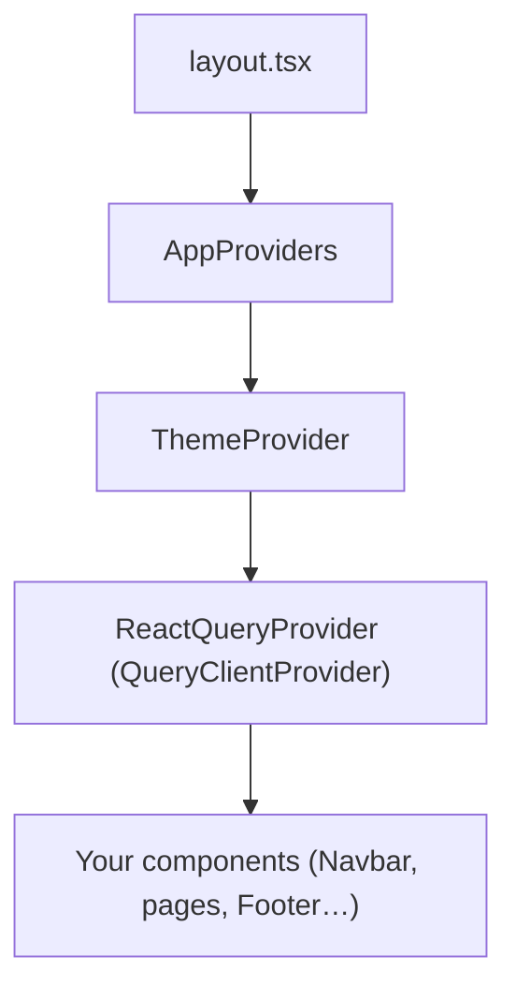

# TanStack Query (React Query v5) — Setup & Usage Guide

> **Status:** ✅ Already installed (`@tanstack/react-query ^5.101.0`) and now wired up.

---

## What was done



Three files were created/updated:

| File | Role |
|---|---|
| `src/providers/react-query-provider.tsx` | Creates `QueryClient` + wraps app in `QueryClientProvider` |
| `src/providers/app-providers.tsx` | Composes **all** providers in one place |
| `src/app/layout.tsx` | Now uses `<AppProviders>` instead of `<ThemeProvider>` |

---

## How to use it in any component

### 1 — Fetching data with `useQuery`

```tsx
"use client";

import { useQuery } from "@tanstack/react-query";
import axios from "axios";

// 1️⃣  Define the shape of your data
interface Candidate {
  id: string;
  name: string;
  atsScore: number;
}

// 2️⃣  Write a plain async fetch function (no React inside)
async function fetchTopCandidates(): Promise<Candidate[]> {
  const { data } = await axios.get("/api/candidates/top");
  return data;
}

// 3️⃣  Use it in a component
export function TopCandidates() {
  const { data, isLoading, isError, error } = useQuery({
    queryKey: ["candidates", "top"],   // ← cache key (array)
    queryFn: fetchTopCandidates,       // ← the fetch function
    staleTime: 30_000,                 // ← optional: override global default
  });

  if (isLoading) return <p>Loading…</p>;
  if (isError)   return <p>Error: {error.message}</p>;

  return (
    <ul>
      {data?.map((c) => (
        <li key={c.id}>{c.name} — {c.atsScore}</li>
      ))}
    </ul>
  );
}
```

---

### 2 — Mutating data with `useMutation`

```tsx
"use client";

import { useMutation, useQueryClient } from "@tanstack/react-query";
import axios from "axios";

async function submitCV(file: File) {
  const form = new FormData();
  form.append("cv", file);
  const { data } = await axios.post("/api/cv/analyze", form);
  return data;
}

export function CVUploadButton() {
  const queryClient = useQueryClient();

  const { mutate, isPending, isSuccess } = useMutation({
    mutationFn: submitCV,
    onSuccess: () => {
      // Automatically refetch any query with this key
      queryClient.invalidateQueries({ queryKey: ["candidates"] });
    },
  });

  return (
    <button
      disabled={isPending}
      onClick={() => mutate(myFile)}
    >
      {isPending ? "Uploading…" : "Upload CV"}
    </button>
  );
}
```

---

### 3 — Query key conventions (important!)

The `queryKey` is how React Query identifies cached data. Keep it structured:

```ts
// ✅ Good — hierarchical, easy to invalidate in bulk
["candidates"]                     // all candidates
["candidates", "top"]              // top candidates list
["candidates", { id: "abc123" }]   // single candidate

// Invalidate all candidate queries at once:
queryClient.invalidateQueries({ queryKey: ["candidates"] });
```

---

### 4 — Organising your queries (recommended pattern)

Create a `src/lib/queries/` folder for all query functions:

```
src/
  lib/
    queries/
      candidates.ts    ← fetchCandidates, fetchTopCandidates
      cv.ts            ← submitCV, analyzeCVScore
      companies.ts     ← fetchActiveCompanies
```

**Example `candidates.ts`:**
```ts
import axios from "axios";

export const candidateKeys = {
  all: ["candidates"] as const,
  top: () => [...candidateKeys.all, "top"] as const,
  detail: (id: string) => [...candidateKeys.all, { id }] as const,
};

export async function fetchTopCandidates() {
  const { data } = await axios.get("/api/candidates/top");
  return data;
}
```

Then in your component:
```tsx
import { useQuery } from "@tanstack/react-query";
import { candidateKeys, fetchTopCandidates } from "@/lib/queries/candidates";

const { data } = useQuery({
  queryKey: candidateKeys.top(),
  queryFn: fetchTopCandidates,
});
```

---

## Key concepts cheat sheet

| Concept | What it means |
|---|---|
| `staleTime` | How long data is "fresh" — no refetch during this window (default: 60s) |
| `gcTime` | How long unused data stays in cache before being deleted (default: 5min) |
| `queryKey` | Unique identifier for each cached dataset |
| `invalidateQueries` | Marks data as stale → triggers background refetch |
| `isPending` | `true` while the first fetch is in progress (no cached data yet) |
| `isFetching` | `true` during any fetch, including background refetches |

---

> [!TIP]
> **Server Components vs Client Components:** `useQuery` only works inside `"use client"` components. For Server Components, fetch directly with `fetch()` or `axios` — no hooks needed.

> [!NOTE]
> **DevTools:** Install `@tanstack/react-query-devtools` for a visual cache inspector in development. Add `<ReactQueryDevtools />` inside `ReactQueryProvider` for instant visibility into all active queries.
